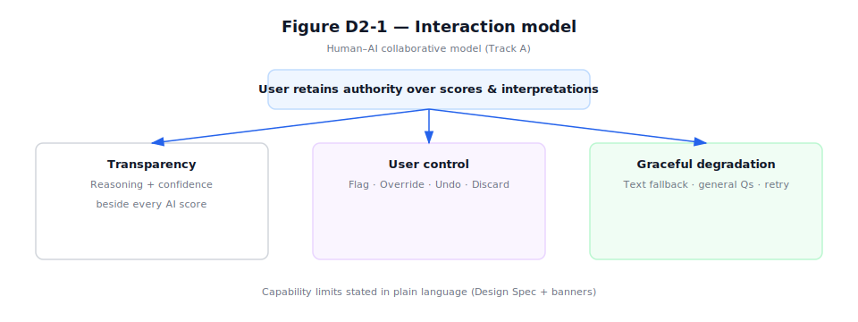
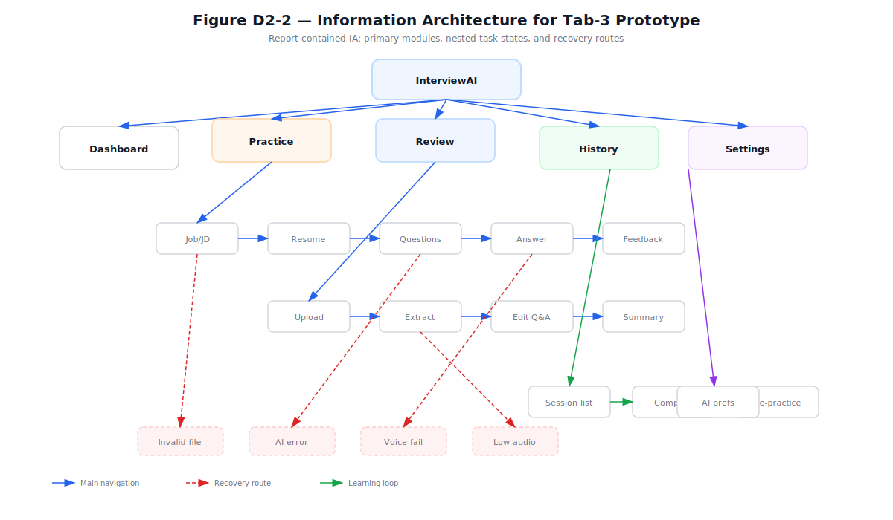
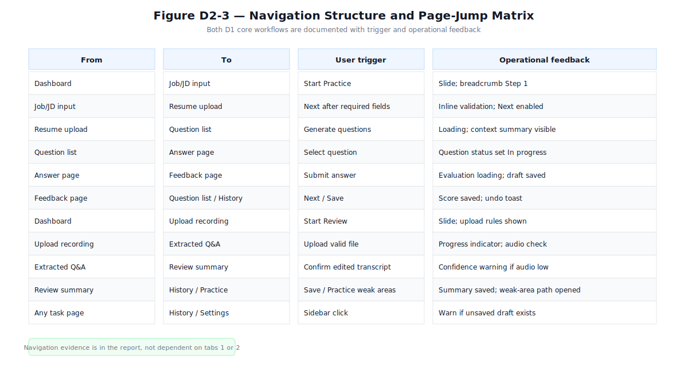
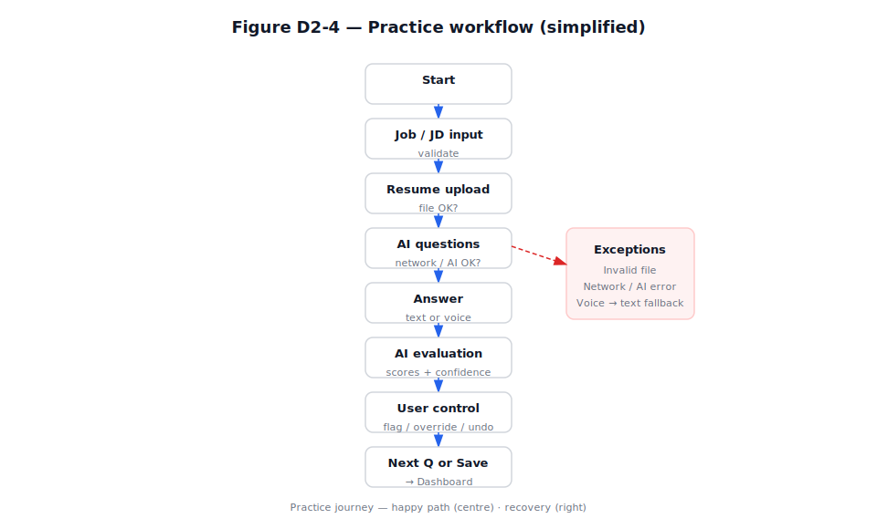
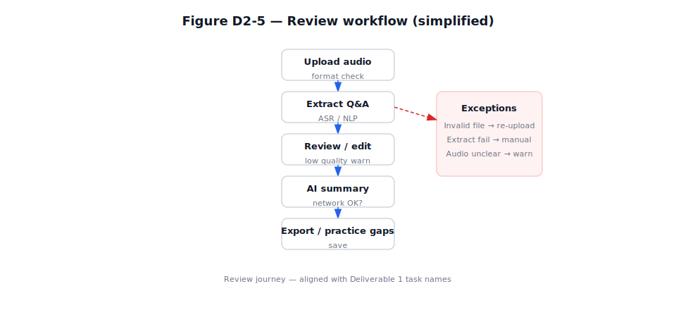
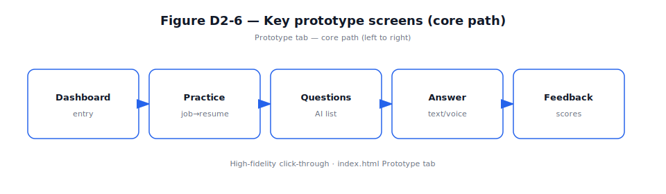
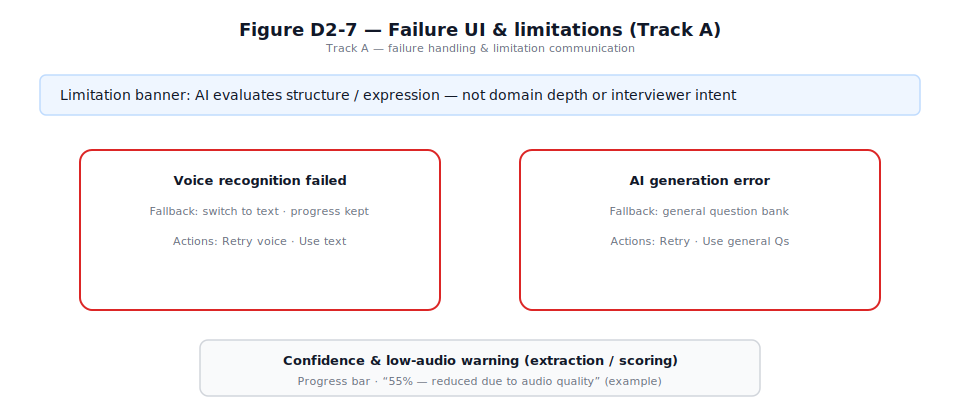

# Deliverable 2 — Interaction Design Solution and Interactive Prototype

**COMP7505 User Interface Design and Development — Group Project**

| | |
|---|---|
| Product | AI Interview Copilot (InterviewAI) |
| Track | Track A — Smart Adaptive Interfaces |
| Document version | 1.0 (submission draft) |
| Prototype artefact | Single-page HTML prototype (interactive) |

This chapter responds to **§II, Deliverable 2** of the *COMP7505 Group Project Description*: (1) **Interaction Design Specification**, (2) **Full Workflow of Core Tasks**, and (3) **Interactive Prototype**. The same chapter supports the grading module **“Interaction Design & Prototype Quality”** (**§V**).

**Everything below is grounded in our team’s Deliverable 1 (D1).** D1 established *who* we design for, *what* end-to-end tasks must succeed, and *what* is out of scope. We do **not** introduce new user goals here; we **specify interaction structure, flows, and a prototype** that **realise** those D1 commitments. Naming of journeys (**Practice** vs **Review**), emphasis on **trustworthy and inspectable AI behaviour**, and **explicit limits** on automation all follow from D1—not from generic “AI app” patterns.

---

## 1. Introduction

The course allows functions to be **simulated** rather than fully implemented (**§I**). Our team therefore delivers a **single-file HTML prototype** with three tabs—**Design Spec**, **Flow Diagrams**, and **Prototype**—linking specification, diagrams, and a click-through demo in one place. Methodologically, we relate the information structure to **card sorting** and an explicit information framework (*Workshop Handout Day 2*).

The chapter is organised to mirror the three mandatory components of Deliverable 2, then documents **Track A** minimum interface requirements (**§III**), and closes with a consolidated **list of figures**. The figures throughout this chapter are **schematic diagrams** aligned with §2–§4; they summarise the same content as the embedded specification and flow views in the prototype.

### 1.1 From Deliverable 1 to this chapter — why we designed it this way

Deliverable 1 combined **pre-project user research** (a short questionnaire with target users) with a **primary persona**, **core user task** definition, and **project scope & boundaries**. The following table states how those D1 outputs **directly motivate** the design choices in §2–§5.

| D1 input | User or research insight (summary) | Design response in this deliverable |
|----------|-------------------------------------|-------------------------------------|
| Questionnaire & interviews | Candidates worry whether **AI feedback is reliable**, find feedback **too generic**, and feel the system **does not fully use resume/JD context**; many want practice that feels **closer to a real interview**. | We prioritise **Track-aligned transparency**: reasoning text and **confidence** next to scores; **capability boundaries** in plain language; **user control** (flag, override, undo) so users are not forced to trust a black box. |
| Persona (D1) | **Fresh graduates** in tech-facing roles, **laptop-first** preparation, iterative polishing before interviews. | **Information architecture** centres on **Practice** and **Review** as two primary workspaces; **History** supports iteration; layout assumes **focused desktop** use. |
| Core user task (D1) | End-to-end preparation: **(A)** role/JD/resume → tailored questions → answer → actionable feedback; **(B)** optional path using **recorded interview** → extraction → review → summary. | §3 flowcharts and the prototype implement **A** and **B** explicitly; labels match D1’s **Practice** and **Review** journeys so success criteria stay traceable. |
| Scope & boundaries (D1) | AI is a **support tool**, not the final judge; the system must **signal low confidence** or insufficient context; **no** full recruitment platform or verified company question database. | **Banner and limitation copy** on evaluation; **degraded** and **fallback** paths when extraction or generation fails; scope is reflected in what the UI **refuses to claim** (e.g. domain depth, interviewer intent). |

We selected **Track A — Smart Adaptive Interfaces** because D1 pain points are fundamentally about **human–AI collaboration**: users need **adaptation** (JD/resume-aware practice) without losing **agency** or **trust**. The interaction model in §2.1 is our answer to that tension—not a default template.

---

## 2. Interaction Design Specification

*Corresponds to Group Project Description §II — “Interaction Design Specification: interaction model, overall information architecture, and navigation structure.”*

### 2.1 Interaction model

We use a **human–AI collaborative** model: the system supports preparation and reflection, but the user keeps authority over interpretations and scores. D1 explicitly assumed that **users retain judgment** while AI assists; our model implements that assumption in the interface, not only in written scope.

Three behaviours run through the UI—each maps to a recurring theme in D1 research:

- **Transparency** — scores and suggestions are paired with short reasoning and **confidence**, so users can judge relevance. *Rationale (D1):* participants reported uncertainty about whether AI feedback was **trustworthy** and wanted clearer **signals** about when advice applied.
- **User control** — users can flag errors, override scores, undo, or discard a flawed evaluation (aligned with Track A). *Rationale (D1):* users wanted to **challenge** generic or misfit suggestions rather than adopt them as “standard answers.”
- **Graceful degradation** — when recognition or generation fails, the UI offers text input, fallback content, or retry instead of a dead end. *Rationale (D1):* preparation happens **under time pressure**; dead ends would break realistic rehearsal.

We also state **capability limits** in plain language (what the system can infer vs. what requires a human interviewer), so expectations stay realistic—consistent with D1’s boundary that the product must **not over-claim** understanding of niche depth or company-specific truth.

**Figure D2-1.** *Design Spec* tab — summary of the interaction principles (transparency, control, degradation).

### 2.2 Information architecture

Top-level areas are **Dashboard**, **Practice**, **Review**, **History**, and **Settings**. This split mirrors D1’s **two core workflows** (live practice vs. post-hoc review of a recording) plus **entry** (Dashboard), **continuity** (History), and **preferences** (Settings). **Practice** and **Review** contain nested steps (e.g. job context → resume → questions → answer → feedback; upload → extract → summary)—the same stages named in D1’s task narrative. **Exception-related** branches (voice failure, AI error, extraction failure) are included in the IA view so failures are part of the structure, not an afterthought—because D1 scoped **unreliable AI or audio** as realistic constraints, not edge cases we can ignore in the diagram.

**Figure D2-2.** *Design Spec* tab — **information architecture** (global modules, nested Practice flow, key failure routes).

### 2.3 Navigation structure

**Global navigation** uses a **persistent sidebar** across modules. **Multi-step** flows use **breadcrumbs** and **Next / Back** where appropriate. A **navigation transition table** records primary **page jumps**: from-state, to-state, user trigger, and transition type (e.g. slide, fade), which documents **operational feedback** between states as required by §II.

**Figure D2-3.** *Design Spec* tab — excerpt of the **navigation transition table** (primary jumps).

---

## 3. Full Workflow of Core Tasks

*Corresponds to Group Project Description §II — “Full Workflow of Core Tasks: end-to-end interaction flowcharts including page jumps, operational feedback, and exception branches,” aligned with **Deliverable 1** core user tasks.*

### 3.1 Alignment with Deliverable 1

Deliverable 1 defines **one integrated goal**—prepare for a specific interview using AI support—with two concrete **paths**: **Practice** (generate and answer role-relevant questions, receive feedback) and **Review** (upload a recording, extract Q&A, receive a structured summary). The flowcharts in §3.2–3.3 are a **direct decomposition** of those paths: they add **operational detail** (page-level steps, system feedback, failure recovery) required by §II but **not** new user goals.

We keep **terminology aligned with D1** so reviewers can map any screen or branch back to the D1 task description and success criteria. If the team finalises different wording in D1, **flowchart labels and this section should be updated together** so traceability is preserved.

### 3.2 Practice workflow

The **Practice** flow runs from role/JD input and resume upload through AI-generated questions, text or voice answers, AI evaluation, user control actions, then next question or save/exit. The diagram includes **decision nodes** (validation, network, AI success, voice recognition) and **exception branches** (invalid file, network error, AI error, voice failure) with **recovery** (retry, fallback, manual input).

**Figure D2-4.** *Flow Diagrams* tab — **Practice** end-to-end flow (happy path + exception cluster).

### 3.3 Review workflow

The **Review** flow runs from audio upload through extraction and optional editing of Q&A, to feedback summary and export or follow-up. It includes branches for invalid upload, extraction failure, low audio quality, and network issues, with explicit recovery paths.

**Figure D2-5.** *Flow Diagrams* tab — **Review** end-to-end flow (happy path + exceptions).

### 3.4 Page jumps, feedback, and exceptions (summary)

Together, §3.2–3.3 satisfy §II’s requirement for **page jumps**, **operational feedback**, and **exception branches**. The **Prototype** tab implements the same branches at a demonstrable level (see §4), including modals for selected failures.

---

## 4. Interactive Prototype

*Corresponds to Group Project Description §II — “Interactive Prototype: appropriate fidelity (high-fidelity recommended; tools such as Figma, Axure, etc., are acceptable) that fully covers the entire core task workflow.”*

### 4.1 Fidelity and coverage of core tasks

The **Prototype** tab provides a **high-fidelity**, **click-through** experience: **Dashboard**, full **Practice** path, **Review** path, **History**, and **Settings**. **Fault scenarios** can be shown via controls that open **voice recognition failure** and **AI generation error** modals, matching exception nodes on the flowcharts.

### 4.2 Submission artefact

The interactive prototype is submitted as **one self-contained HTML file** (simulated AI and error paths; no backend required). If the course asks for a public link, the team may host the same file on a static page (for example a project hosting service) and cite that URL in the portfolio.

**Figure D2-6.** *Prototype* tab — key screens along the **core path** (schematic strip).

**Figure D2-7.** *Prototype* tab — **failure and limitation** patterns (Track A: banner, two failure modals, confidence / audio-quality line).

---

## 5. Track A — Minimum Standards (§III)

*Track-specific requirements are minimum completion criteria; failure to meet them can reduce the Track-Specific Compliance module (**§V**).*

These requirements also **reinforce D1**: users who doubt AI reliability (see §1.1) need **visible boundaries**, **recoverable failures**, and **honest limitation signals**—which is exactly what the §III checklist demands.

| §III requirement | Where it appears in our design |
|------------------|--------------------------------|
| **Capability boundaries** — what the system can and cannot do | *Design Spec*: Can / Cannot / Limited list; *Prototype*: contextual banner on evaluation views. |
| **User control** — override, confirmation, undo, etc. | *Prototype*: Feedback actions (flag, override, undo, discard); *Settings*: confirmations for sensitive actions. |
| **≥ Two system failure interface solutions** | *Prototype*: modals for **voice recognition failed** and **AI generation error** (with fallbacks/retry). |
| **≥ One mechanism communicating limitations** | Confidence indicators; low-confidence copy; **audio quality** warning on extraction. |

### 5.1 Capability Boundaries in the Written Report / 书面报告中的系统能力边界

To satisfy the Track A requirement that the team **clearly define the intelligent system's capability boundaries**, this report states the same boundary information in the written deliverable, rather than relying only on the explanatory tabs of the HTML prototype. The interactive prototype is mainly used to demonstrate the core task workflow; therefore, the written report must also remain self-contained and assessable.

为满足 Track A 对“明确界定智能系统能力边界”的要求，本报告将系统能力边界直接写入书面交付物，而不是仅依赖 HTML 原型中的说明性标签页。由于原型主要用于展示核心任务流程，书面报告本身也必须具备完整的评审信息。

| Boundary type / 边界类型 | Statement / 能力边界说明 | Rationale / 设计理由 |
|--------------------------|--------------------------|----------------------|
| **Can / 能做** | The system can evaluate answer **structure**, **logical flow**, **expression clarity**, and **STAR framework usage**. 系统可以评估回答的**结构**、**逻辑流程**、**表达清晰度**以及 **STAR 框架使用情况**。 | These are observable communication qualities that directly support the D1 interview-preparation task. 这些属于可观察的表达质量，直接服务于 D1 中定义的面试准备任务。 |
| **Can / 能做** | The system can generate **role-relevant interview questions** based on job-description keywords and resume context. 系统可以基于职位描述关键词和简历上下文生成**与岗位相关的面试问题**。 | This supports personalised practice while staying within the information provided by the user. 这可以支持个性化练习，同时不超出用户提供的信息范围。 |
| **Cannot / 不能做** | The system cannot judge **industry-specific technical depth** or verify domain expertise. 系统不能判断**行业特定技术深度**，也不能验证用户的领域专业能力。 | Such judgement requires expert human assessment and may depend on company-specific standards. 此类判断需要专家级人工评估，并可能依赖具体公司的评价标准。 |
| **Cannot / 不能做** | The system cannot replace real interviewer judgement or **guarantee interview outcomes**. 系统不能替代真实面试官的判断，也不能**保证面试结果**。 | D1 defines the AI as a support tool for preparation, not as the final decision-maker. D1 将 AI 定义为面试准备的辅助工具，而不是最终决策者。 |
| **Limited / 受限** | Voice and speech-analysis accuracy depends on **audio quality**, accent, noise, and recording conditions. 语音与口语分析的准确性会受到**音频质量**、口音、噪音和录制条件影响。 | This limitation explains why the interface provides low-confidence warnings and fallback text input. 该限制解释了为什么界面需要提供低置信度提示和文本输入兜底方案。 |

---

## 6. Alignment with “Interaction Design & Prototype Quality” (§V)

| §V emphasis | How this chapter addresses it |
|-------------|-------------------------------|
| Rationality of interaction logic | Linear guided flows; explicit confirm/retry/fallback; AI outputs tied to confidence and user actions (§2–4). |
| Clarity of information architecture | Single top-level IA; nested flows; failure routes in IA (§2.2, Figure D2-2). |
| Prototype completeness | Both core journeys plus History and Settings; demonstrable failure UIs (§4). |
| Integrity of core task workflows | Flowcharts (§3) match navigable screens and modals in the prototype (§4). |

---

## 7. List of figures

| Figure | Caption |
|--------|---------|
| Figure D2-1 | Interaction model: transparency, user control, graceful degradation. |
| Figure D2-2 | Information architecture and main exception paths. |
| Figure D2-3 | Navigation structure: primary transitions and triggers. |
| Figure D2-4 | Full Practice workflow with exception branches (simplified). |
| Figure D2-5 | Full Review workflow with exception branches (simplified). |
| Figure D2-6 | Key screens along the primary user journey. |
| Figure D2-7 | Track A: failure handling and limitation communication. |

---

## 8. Conclusion

This deliverable provides (1) an **interaction design specification**, (2) **full core-task workflows** with **page jumps, feedback, and exception branches**, and (3) a **high-fidelity interactive prototype** covering those workflows, as required by **§II**. The content is **derived from Deliverable 1**: persona, questionnaire insights, core user tasks, and scope jointly motivated the interaction model, IA split, dual workflows, and Track A patterns. It documents **Track A** minimum interface expectations (**§III**) and aligns with **Interaction Design & Prototype Quality** (**§V**). The prototype is also intended as the **test surface** for **Deliverable 3** (evaluation and iteration).

---

## References

1. COMP7505 *Group Project Description* (Moodle: COMP7505 → Project) — §I Core Project Brief; §II Mandatory Deliverable Components; §III Track A; §V Main Grading Criteria.

2. COMP7505 *Workshop Handout Day 2* — Card sorting and information framework for navigation and task journeys.

3. **Team Deliverable 1 (this project)** — User research questionnaire and synthesis; primary persona / user profile; **core user tasks** (Practice and Review journeys); **project scope & boundaries** (including design assumptions and excluded services). This chapter implements those definitions rather than replacing them.

---

*End of Deliverable 2.*
