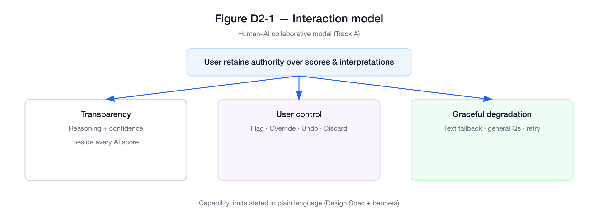
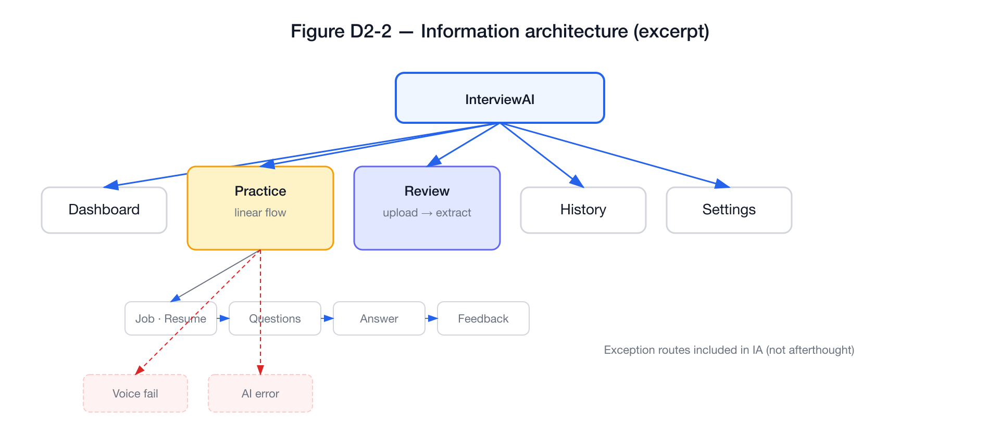
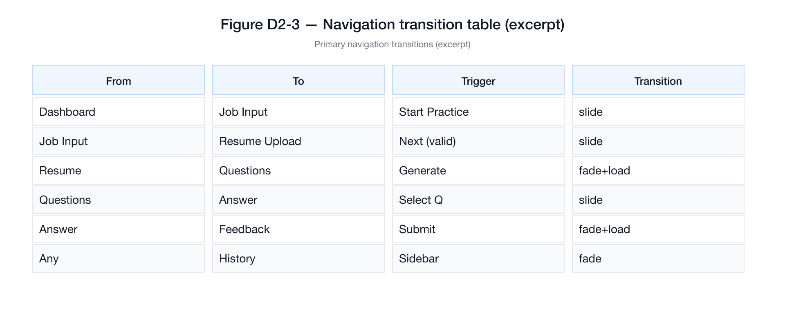
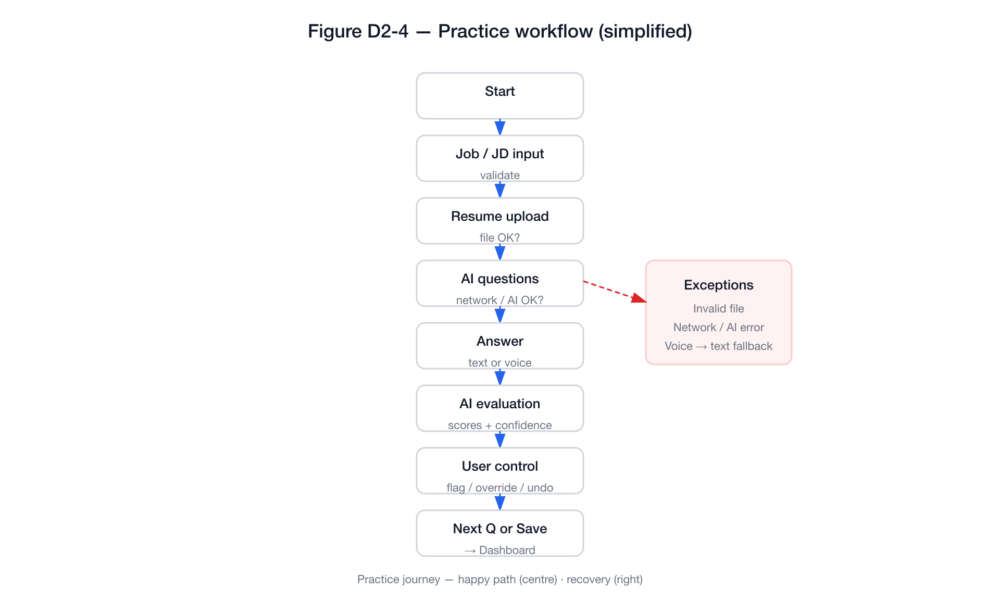
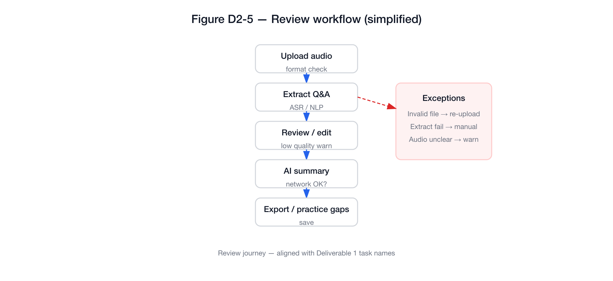
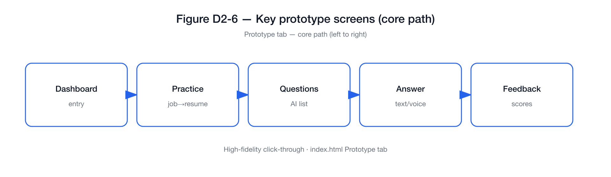
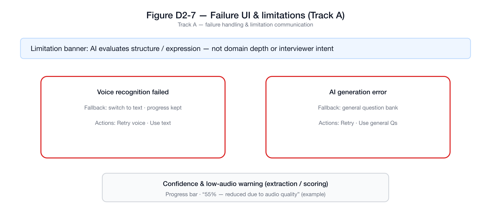

# Deliverable 2 — Interaction Design Solution and Interactive Prototype

**COMP7505 User Interface Design and Development — Group Project**

| | |
|---|---|
| Product | AI Interview Copilot (InterviewAI) |
| Track | Track A — Smart Adaptive Interfaces |
| Document version | 1.0 (submission draft) |
| Prototype artefact | `index.html` (repository root) |

This chapter responds to **§II, Deliverable 2** of the *COMP7505 Group Project Description*: (1) **Interaction Design Specification**, (2) **Full Workflow of Core Tasks**, and (3) **Interactive Prototype**. The same chapter supports the grading module **“Interaction Design & Prototype Quality”** (**§V**). Where **Deliverable 1** defines personas, core user tasks, and success criteria, we use consistent naming here so reviewers can trace requirements through to flows and screens.

---

## 1. Introduction

The course allows functions to be **simulated** rather than fully implemented (**§I**). Our team therefore delivers a **single-file HTML prototype** (`index.html`) with three tabs—**Design Spec**, **Flow Diagrams**, and **Prototype**—linking specification, diagrams, and a click-through demo in one place. Methodologically, we relate the information structure to **card sorting** and an explicit information framework (*Workshop Handout Day 2*).

The chapter is organised to mirror the three mandatory components of Deliverable 2, then documents **Track A** minimum interface requirements (**§III**), and ends with a **figure list** for the PDF report.

**Figures in this file:** SVG + PNG exports live in `figures/` (same folder as this Markdown). They are **submission-ready schematics** aligned with §2–§4 (Style 1 flat, validated with `rsvg-convert`). You may optionally replace any figure with a **screenshot** from `index.html` if your instructor asks for pixel-identical captures of the Mermaid/prototype UI.

---

## 2. Interaction Design Specification

*Corresponds to Group Project Description §II — “Interaction Design Specification: interaction model, overall information architecture, and navigation structure.”*

### 2.1 Interaction model

We use a **human–AI collaborative** model: the system supports preparation and reflection, but the user keeps authority over interpretations and scores. Three behaviours run through the UI:

- **Transparency** — scores and suggestions are paired with short reasoning and confidence, so users can judge relevance.
- **User control** — users can flag errors, override scores, undo, or discard a flawed evaluation (aligned with Track A).
- **Graceful degradation** — when recognition or generation fails, the UI offers text input, fallback content, or retry instead of a dead end.

We also state **capability limits** in plain language (what the system can infer vs. what requires a human interviewer), so expectations stay realistic.

**Figure D2-1.** *Design Spec* tab — summary of the interaction principles (transparency, control, degradation).

### 2.2 Information architecture

Top-level areas are **Dashboard**, **Practice**, **Review**, **History**, and **Settings**. **Practice** and **Review** contain nested steps (e.g. job context → resume → questions → answer → feedback; upload → extract → summary). **Exception-related** branches (voice failure, AI error, extraction failure) are included in the IA view so failures are part of the structure, not an afterthought.

**Figure D2-2.** *Design Spec* tab — **information architecture** (global modules, nested Practice flow, key failure routes).

### 2.3 Navigation structure

**Global navigation** uses a **persistent sidebar** across modules. **Multi-step** flows use **breadcrumbs** and **Next / Back** where appropriate. A **navigation transition table** records primary **page jumps**: from-state, to-state, user trigger, and transition type (e.g. slide, fade), which documents **operational feedback** between states as required by §II.

**Figure D2-3.** *Design Spec* tab — excerpt of the **navigation transition table** (primary jumps).

---

## 3. Full Workflow of Core Tasks

*Corresponds to Group Project Description §II — “Full Workflow of Core Tasks: end-to-end interaction flowcharts including page jumps, operational feedback, and exception branches,” aligned with **Deliverable 1** core user tasks.*

### 3.1 Alignment with Deliverable 1

Core tasks in D1 should name the end-to-end journeys (e.g. complete a **Practice** session with AI feedback; complete a **Review** of a recording). The flowcharts below use the same journey names; if D1 task wording is updated before submission, **flowchart labels and this section should be updated in the same pass** so success criteria remain traceable.

### 3.2 Practice workflow

The **Practice** flow runs from role/JD input and resume upload through AI-generated questions, text or voice answers, AI evaluation, user control actions, then next question or save/exit. The diagram includes **decision nodes** (validation, network, AI success, voice recognition) and **exception branches** (invalid file, network error, AI error, voice failure) with **recovery** (retry, fallback, manual input).

**Figure D2-4.** *Flow Diagrams* tab — **Practice** end-to-end flow (happy path + exception cluster).

### 3.3 Review workflow

The **Review** flow runs from audio upload through extraction and optional editing of Q&A, to feedback summary and export or follow-up. It includes branches for invalid upload, extraction failure, low audio quality, and network issues, with explicit recovery paths.

**Figure D2-5.** *Flow Diagrams* tab — **Review** end-to-end flow (happy path + exceptions).

### 3.4 Page jumps, feedback, and exceptions (summary)

Together, §3.2–3.3 satisfy §II’s requirement for **page jumps**, **operational feedback**, and **exception branches**. The **Prototype** tab implements the same branches at a demonstrable level (see §4), including modals for selected failures.

---

## 4. Interactive Prototype

*Corresponds to Group Project Description §II — “Interactive Prototype: appropriate fidelity (high-fidelity recommended; tools such as Figma, Axure, etc., are acceptable) that fully covers the entire core task workflow.”*

### 4.1 Fidelity and coverage of core tasks

The **Prototype** tab provides a **high-fidelity**, **click-through** experience: **Dashboard**, full **Practice** path, **Review** path, **History**, and **Settings**. **Fault scenarios** can be shown via controls that open **voice recognition failure** and **AI generation error** modals, matching exception nodes on the flowcharts.

### 4.2 Submission artefact

- **File:** `index.html` at the repository root (self-contained; simulated AI and errors).  
- **Online (optional):** if the team publishes **GitHub Pages** or another host, add the URL in the portfolio cover sheet or appendix.

**Figure D2-6.** *Prototype* tab — key screens along the **core path** (schematic strip).

**Figure D2-7.** *Prototype* tab — **failure and limitation** patterns (Track A: banner, two failure modals, confidence / audio-quality line).

---

## 5. Track A — Minimum Standards (§III)

*Track-specific requirements are minimum completion criteria; failure to meet them can reduce the Track-Specific Compliance module (**§V**).*

| §III requirement | Where it appears in our design |
|------------------|--------------------------------|
| **Capability boundaries** — what the system can and cannot do | *Design Spec*: Can / Cannot / Limited list; *Prototype*: contextual banner on evaluation views. |
| **User control** — override, confirmation, undo, etc. | *Prototype*: Feedback actions (flag, override, undo, discard); *Settings*: confirmations for sensitive actions. |
| **≥ Two system failure interface solutions** | *Prototype*: modals for **voice recognition failed** and **AI generation error** (with fallbacks/retry). |
| **≥ One mechanism communicating limitations** | Confidence indicators; low-confidence copy; **audio quality** warning on extraction. |

---

## 6. Alignment with “Interaction Design & Prototype Quality” (§V)

| §V emphasis | How this chapter addresses it |
|-------------|-------------------------------|
| Rationality of interaction logic | Linear guided flows; explicit confirm/retry/fallback; AI outputs tied to confidence and user actions (§2–4). |
| Clarity of information architecture | Single top-level IA; nested flows; failure routes in IA (§2.2, Figure D2-2). |
| Prototype completeness | Both core journeys plus History and Settings; demonstrable failure UIs (§4). |
| Integrity of core task workflows | Flowcharts (§3) match navigable screens and modals in the prototype (§4). |

---

## 7. List of figures (for the PDF report)

Files are under `UI/docs/figures/` (SVG source + 1920px PNG). Regenerate with `python3 figures/generate_d2_diagrams.py` then re-run `rsvg-convert` if you edit the script.

| ID | File (PNG) | Suggested caption |
|----|------------|-------------------|
| Figure D2-1 | `D2-1_interaction_model.png` | Interaction model: transparency, user control, graceful degradation. |
| Figure D2-2 | `D2-2_information_architecture.png` | Information architecture and main exception paths. |
| Figure D2-3 | `D2-3_navigation_table.png` | Navigation structure: primary transitions and triggers. |
| Figure D2-4 | `D2-4_practice_workflow.png` | Full Practice workflow with exception branches (simplified). |
| Figure D2-5 | `D2-5_review_workflow.png` | Full Review workflow with exception branches (simplified). |
| Figure D2-6 | `D2-6_prototype_core_path.png` | Key screens along the primary user journey. |
| Figure D2-7 | `D2-7_trackA_failures_limits.png` | Track A: failure handling and limitation communication. |

---

## 8. Conclusion

This deliverable provides (1) an **interaction design specification**, (2) **full core-task workflows** with **page jumps, feedback, and exception branches**, and (3) a **high-fidelity interactive prototype** covering those workflows, as required by **§II**. It documents **Track A** minimum interface expectations (**§III**) and aligns with **Interaction Design & Prototype Quality** (**§V**). The prototype is also intended as the **test surface** for **Deliverable 3** (evaluation and iteration).

---

## References

1. COMP7505 *Group Project Description* (Moodle: COMP7505 → Project) — §I Core Project Brief; §II Mandatory Deliverable Components; §III Track A; §V Main Grading Criteria.

2. COMP7505 *Workshop Handout Day 2* — Card sorting and information framework for navigation and task journeys.

---

*End of Deliverable 2.*
